# 📘 SOFTWARE REQUIREMENTS SPECIFICATION & REBUILD BRIEF
## SISTEM INFORMASI PERIKANAN KABUPATEN BANDUNG (SIKANDUNG)

---

## 1. RINGKASAN EKSEKUTIF & TUJUAN PROYEK

### 1.1 Latar Belakang & Identitas Sistem
**SIKANDUNG** (*Sistem Informasi Perikanan Kabupaten Bandung*) adalah platform digital yang dikembangkan untuk **Dinas Ketahanan Pangan dan Perikanan (Dispakan) Kabupaten Bandung**. Aplikasi ini berfungsi sebagai pusat integrasi data sektor perikanan yang mencakup pendataan lapangan (*survei/kuisioner enumerator*), validasi data, pengolahan statistik agregat, pelaporan resmi kedinasan, hingga integrasi satu data daerah (*BAPPEDA / Satu Data Kab. Bandung*).

### 1.2 Tujuan Rebuild
Aplikasi *legacy* dibangun di atas **CodeIgniter 3 (PHP 7.x, Bootstrap 3, jQuery, monolithic architecture)**. Proses *rebuild* bertujuan untuk:
1. **Modernisasi Arsitektur:** Migrasi ke stack modern yang *maintainable*, aman, modular, dan memiliki ekosistem aktif.
2. **Optimalisasi UX/UI Pendataan Lapangan:** Mempermudah petugas enumerator dalam input kuisioner multi-langkah (*wizard form*) dengan validasi kuat dan performa responsif di perangkat *mobile/tablet*.
3. **Penyempurnaan Alur Verifikasi Data:** Penerapan *state machine* validasi berjenjang (Draft $\rightarrow$ Submitted $\rightarrow$ Verified $\rightarrow$ Published) dengan notifikasi *real-time*.
4. **Standardisasi API Eksternal:** Menyediakan RESTful API standar industri dengan autentikasi berbasis API Key/Bearer Token, rate limiting, dan dokumentasi OpenAPI/Swagger untuk integrasi BAPPEDA & Satu Data.
5. **Keamanan & Skalabilitas:** Pembaruan sistem autentikasi, enkripsi, *Role-Based Access Control* (RBAC), serta optimasi query pada data statistik volume & nilai produksi besar.

---

## 2. PILAR DOMAIN BISNIS (3 SEKTOR UTAMA)

Sistem mengelola 3 domain inti sektor perikanan Kabupaten Bandung:

```
                          ┌────────────────────────┐
                          │   SIKANDUNG KAB. BDG   │
                          └───────────┬────────────┘
                                      │
       ┌──────────────────────────────┼──────────────────────────────┐
       ▼                              ▼                              ▼
┌──────────────┐              ┌──────────────┐              ┌────────────────┐
│  PERIKANAN   │              │  PERIKANAN   │              │   PENGOLAHAN   │
│   BUDIDAYA   │              │   TANGKAP    │              │ HASIL PERIKANAN│
└──────┬───────┘              └──────┬───────┘              └───────┬────────┘
       ├─ Pembenihan                 ├─ Nelayan Danau/Waduk         ├─ Olahan Pangan
       ├─ Pembesaran                 ├─ Nelayan Sungai              ├─ Pengawetan/Asap
       ├─ Ikan Hias                  └─ Komoditas Tangkapan         ├─ Keripik/Nugget/Fillet
       └─ Mina Padi                                                 └─ Sertifikasi (P-IRT/Halal/SKP)
```

---

## 3. ANALISIS ARSITEKTUR SISTEM LEGACY VS TARGET MODERN

| Aspek | Sistem Legacy (Saat Ini) | Rekomendasi Arsitektur Target (Rebuild) |
| :--- | :--- | :--- |
| **Backend Framework** | CodeIgniter 3.x (PHP 7.1/7.4) | **Laravel 11.x (PHP 8.3+)** ATAU **NestJS / Go Fiber** |
| **Frontend Admin/Web**| Blade/PHP View + jQuery + AdminLTE/Inspinia + Bootstrap 3 | **React (Next.js / Vite) / Vue 3 (Nuxt 3)** + Tailwind CSS + Shadcn UI / Mantine |
| **Database** | MySQL 5.7 / MariaDB 10.1 (Tanpa migrasi formal) | **PostgreSQL 16+** atau **MariaDB 11+** dengan Database Migration & Seeder |
| **ORM / Data Access** | CI Active Record / Raw Query | **Prisma / Drizzle** (Node.js) atau **Eloquent ORM** (Laravel) |
| **Form Wizard** | jQuery SmartWizard + jQuery Validator | **React Hook Form + Zod** / **VeeValidate + Yup** |
| **State & Lifecycle** | Kolom `visible` (0/1) & `submit` ('Draft'/'Publish') | Formal **State Machine**: `DRAFT`, `SUBMITTED`, `VERIFIED`, `REJECTED`, `ARCHIVED` |
| **PDF Generation** | mPDF Library | **Browsershot / Puppeteer / Typst / React-PDF** |
| **Excel Export** | PHPExcel (Deprecated) | **PhpSpreadsheet / ExcelJS / SheetJS** |
| **Integrasi API** | Hardcoded Token Query Param (`?token=bappedaBedas`) | **API Key / OAuth2 / Bearer Token JWT** dengan Rate Limiter & Swagger UI |
| **Autentikasi & ACL** | Session CI + Zend Permissions ACL (Database manual) | **Spatie Laravel Permission / Lucia Auth / NextAuth / Casbin** |

---

## 4. PERAN PENGGUNA & HAK AKSES (ROLE-BASED ACCESS CONTROL)

| ID Role | Nama Role | Deskripsi & Hak Akses Utama |
| :--- | :--- | :--- |
| **1** | **Super Administrator (IT/Dinas)** | Akses penuh seluruh modul: Pengelolaan User, Hak Akses (ACL), Master Data, Konfigurasi Sistem, API Management, Log Aktivitas. |
| **2** | **Kepala Dinas / Pimpinan (Manager)** | Akses baca (*read-only*) & review: Executive Dashboard, Statistik Makro Wilayah, Rekapitulasi Laporan PDF/Excel, Monitoring Indikator Kinerja. |
| **3** | **Staf Seksi Bidang / Validator** | Akses verifikasi data kuisioner: Memeriksa data masuk dari enumerator, *Approve / Reject* data, Mengelola Master Data Teknis perikanan, Mencetak laporan bidang. |
| **4** | **Petugas Enumerator / Surveyor Lapangan** | Akses entri data: Mengisi kuisioner lapangan (Budidaya, Tangkap, Pengolahan), Simpan *Draft*, Submit untuk diverifikasi, Melihat riwayat entri sendiri. Terbatas pada wilayah tugas masing-masing. |
| **5** | **Pelayanan / Front Desk** | Akses informasi publik, bantuan pendaftaran kelompok perikanan, pencarian data umum. |
| **6** | **Pihak Eksternal (BAPPEDA / Satu Data)** | Akses *Machine-to-Machine* (M2M) via REST API untuk penarikan data statistik agregat secara otomatis. |

---

## 5. SPESIFIKASI MODUL & KEBUTUHAN FUNGSIONAL

### 5.1 Modul 1: Autentikasi, Profil & Pengelolaan Pengguna
1. **Login & Session Management:**
   - Multi-identifier login: Username / NIP / Email.
   - Enkripsi password menggunakan Argon2id atau Bcrypt.
   - Fitur *Remember Me* berbasis secure token rotation.
   - Single Sign-On (SSO) *ready* untuk integrasi masa depan dengan Portal Pemkab Bandung.
2. **User Profile:**
   - Ubah info profil, nomor kontak, foto profil, dan kata sandi.
   - Informasi wilayah penugasan (Kecamatan / Desa terkait).
3. **Audit Log & Activity Monitor:**
   - Pencatatan otomatis waktu login, IP address, user agent, dan aksi *Create, Update, Delete, Submit, Verify*.

---

### 5.2 Modul 2: Manajemen Master Data Wilayah & Parameter Teknis

#### A. Master Wilayah Hierarki
- **Kabupaten / Kota** (Default: Kabupaten Bandung).
- **Kecamatan** (31 Kecamatan di Kab. Bandung: Banjaran, Baleendah, Ciparay, Soreang, Pasirjambu, Ciwidey, Pangalengan, Majalaya, Cicalengka, Rancaekek, dsb.).
- **Desa / Kelurahan** (270+ Desa/Kelurahan terhubung per Kecamatan).

#### B. Master Parameter Teknis Perikanan
1. **Perikanan Budidaya:**
   - *Jenis & Kategori Budidaya*: Pembenihan, Pembesaran, Ikan Hias, Mina Padi.
   - *Komoditas Ikan*: Nila, Mas, Lele, Patin, Gurame, Koi, Komet, Cupang, Guppy, dll.
   - *Bahan & Sarana Produksi*: Pakan (Pelet/Alami), Kapur, Pupuk, Obat/Vitamin, Listrik, BBM.
   - *Komponen Biaya Produksi*: Pembelian Induk, Pembelian Benih, Tenaga Kerja, Sewa Lahan, Operasional.
   - *Sertifikasi & Perizinan*: CBIB (Cara Budidaya Ikan yang Baik), CPIB (Cara Pembenihan Ikan yang Baik), NIB, IUMK.
2. **Perikanan Tangkap:**
   - *Kategori & Jenis Tangkapan*: Ikan Air Tawar Perairan Umum Darat (PUD) — Danau, Sungai, Waduk (Saguling, Cirata, dll.).
   - *Armada & Alat Tangkap*: Perahu tanpa motor, perahu motor tempel, jaring insang (*gill net*), pancing, bubu, jala.
   - *Biaya Operasional Tangkap*: BBM/Solar, Perawatan Alat Tangkap, Umpan, Es Balok, Tenaga Kerja.
   - *Perizinan Tangkap*: Tanda Daftar Kapal Perikanan (TDKP), SIUP Perikanan.
3. **Pengolahan Hasil Perikanan:**
   - *Komoditas Produk Olahan*: Pindang, Ikan Asap, Keripik Kulit Ikan, Nugget Ikan, Bakso Ikan, Abon Ikan, Ikan Kering/Asin, dll.
   - *Bahan Utama*: Ikan Segar (Spesifikasi jenis ikan & asal bahan baku).
   - *Bahan Penolong/Lainnya*: Minyak goreng, bumbu, tepung, kemasan/packaging, gas LPG.
   - *Peralatan Produksi*: Mesin giling, *freezer*, mesin *sealer*, oven pengasapan, wajan besar.
   - *Sertifikasi & Perizinan*: Sertifikat Kelayakan Pengolahan (SKP), P-IRT (Dinkes), Halal (BPJPH/MUI), BPOM MD, HKI Merek.

---

### 5.3 Modul 3: Kuisioner & Pendataan Lapangan (Core Transaction)

Modul ini adalah inti operasional sistem yang digunakan enumerator untuk mencatat data pelaku usaha perikanan di 31 kecamatan.

```
┌─────────────────────────────────────────────────────────────────────────────┐
│                    ALUR PENDATAAN & VERIFIKASI KUISIONER                    │
└─────────────────────────────────────────────────────────────────────────────┘
  Enumerator                   Validator (Staf/Kasi)              Database
      │                                  │                            │
      │── 1. Isi Wizard Step 1-6 ───────┼───────────────────────────>│ [Status: DRAFT]
      │── 2. Submit Kuisioner ──────────┼───────────────────────────>│ [Status: SUBMITTED]
      │                                  │                            │
      │                                  │── 3. Review & Verifikasi ──│
      │                                  │    ├─ Setujui ────────────>│ [Status: VERIFIED] ──> Masuk Statistik
      │                                  │    └─ Tolak + Catatan ────>│ [Status: REJECTED]
      │<─ 4. Notifikasi Hasil Review ────│                            │
```

#### Detail Step Kuisioner (Budidaya / Tangkap / Pengolahan)

##### 1. Kuisioner Perikanan Budidaya
* **Step 1: Identitas Responden & Usaha**
  - Data Enumerator (Nama Petugas, Tanggal Kuisioner).
  - Identitas Pembudidaya (NIK, Nama Lengkap, No HP/WhatsApp, Alamat, RT/RW, Desa, Kecamatan).
  - Kelembagaan (Nama Kelompok Pembudidaya Ikan / Pokdakan, Jabatan: Ketua/Sekretaris/Bendahara/Anggota).
* **Step 2: Keterangan Umum Usaha**
  - Kegiatan Usaha (*Radio: Pembenihan / Pembesaran / Ikan Hias / Mina Padi*).
  - Jenis Komoditas Utama & Tambahan.
  - Luas Lahan / Luas Kolam ($m^2$), Jumlah Kolam, Status Kepemilikan Lahan (Milik/Sewa).
  - Sumber Air (Irigasi, Mata Air, Sungai, Sumur Bor).
  - Siklus Produksi (Durasi per siklus dalam bulan, Frekuensi panen per tahun).
* **Step 3: Biaya Produksi per Siklus**
  - Pengadaan Benih/Induk (Volume ekor, Harga satuan, Total biaya).
  - Tenaga Kerja (Jumlah orang, Upah per siklus).
  - Sewa lahan / Penyusutan kolam.
* **Step 4: Bahan Lainnya / Sarana Prasarana**
  - Pakan Pelet / Pakan Alami (Kg/Zak, Harga satuan, Subtotal).
  - Pupuk, Kapur, Probiotik, Vitamin/Obat.
  - Penggunaan Energi (Listrik, BBM/Solar untuk pompa).
* **Step 5: Nilai Produksi / Panen**
  - Volume Panen per Siklus (Kg / Ekor).
  - Ukuran/Size Ikan saat panen.
  - Harga Jual per Kg / per Ekor ($Rp$).
  - Perhitungan Total Nilai Produksi ($Rp$ Omzet/Siklus & Omzet/Tahun otomatis terkalkulasi).
  - Saluran Distribusi / Pemasaran (Tengkulak, Pasar Lokal, Restoran, Ekspor, Konsumen Langsung).
* **Step 6: Perizinan & Sertifikasi**
  - Kepemilikan NIB, CPIB/CBIB, SKP.
  - Nomor Sertifikat, Tanggal Terbit, Masa Berlaku, Unggah Foto/Dokumen Bukti.

##### 2. Kuisioner Perikanan Tangkap
* **Step 1: Identitas Nelayan & KUB**
  - Identitas Responden, NIK, No Kartu KUSUKA (Kartu Pelaku Usaha Kelautan dan Perikanan), Nama Kelompok Usaha Bersama (KUB).
* **Step 2: Keterangan Operasional Tangkap**
  - Lokasi Penangkapan (Nama Danau/Waduk/Sungai, Titik Koordinat GPS / Geo-tagging jika memungkinkan).
  - Hari Operasi per Bulan, Jumlah Trip per Tahun.
  - Armada: Jenis Perahu/Kapal, Dimensi ($P \times L \times D$), Tenaga Mesin (PK/HP).
  - Alat Tangkap Utama & Bantu (Jumlah unit, Ukuran mata jaring/mesh size).
* **Step 3: Biaya Operasional Penangkapan**
  - Biaya BBM/Solar per trip, Oli, Es balok, Ransum/Makan ABK, Retribusi/Tambat labuh.
* **Step 4: Hasil Tangkapan & Nilai Produksi**
  - Jenis Ikan Tangkapan (Nila, Mas, Mujair, Gabus, Baung, dll.).
  - Rata-rata Volume Tangkapan per Trip (Kg) & Estimasi per Tahun.
  - Harga Jual per Kg di TPI / Pengepul.
  - Total Nilai Produksi ($Rp$).
* **Step 5: Perizinan & Sertifikasi**
  - TDKP, Pas Kecil, Asuransi Nelayan.

##### 3. Kuisioner Pengolahan Hasil Perikanan
* **Step 1: Identitas Pengolah (UPI / Poklahsar)**
  - Nama Unit Pengolah Ikan (UPI) / Kelompok Pengolah dan Pemasar (Poklahsar).
  - Penanggung Jawab, NIK, Alamat Pabrik/Dapur Produksi, Titik Koordinat.
* **Step 2: Keterangan Usaha & Kapasitas Produksi**
  - Jenis Produk Olahan (Pindang, Asap, Kerupuk, Frozen Food, dsb.).
  - Kapasitas Produksi Terpasang vs Kapasitas Riil (Kg/Bulan).
* **Step 3: Bahan Baku Utama & Bahan Tambahan**
  - Kebutuhan Ikan Segar (Jenis ikan, Volume Kg/Bulan, Asal Bahan Baku: Lokal/Luar Kab).
  - Bahan Penolong: Bumbu, Minyak, Pengawet Alami, Tepung, Kemasan.
* **Step 4: Peralatan & Sarana Produksi**
  - Daftar Mesin/Alat, Nilai Investasi Alat, Kondisi Alat.
* **Step 5: Nilai Produksi & Pemasaran**
  - Volume Produksi per Bulan / per Tahun (Pcs/Kemasan/Kg).
  - Harga Jual per Unit ($Rp$).
  - Omzet Bulanan & Tahunan.
  - Jangkauan Pasar (Pasar Tradisional, Supermarket, Online/E-Commerce, Antar-Kota).
* **Step 6: Legalitas & Sertifikasi Produk**
  - NIB, P-IRT, Halal MUI/BPJPH, Sertifikat Kelayakan Pengolahan (SKP), BPOM MD.

---

### 5.4 Modul 4: Dashboard Eksekutif & Visualisasi Data Statistik

1. **Ringkasan Indikator Kinerja Utama (KPI Cards):**
   - Total Pelaku Usaha / Kelompok (Budidaya, Tangkap, Pengolahan).
   - Total Luas Lahan Budidaya ($m^2$ / Hektar).
   - Total Volume Produksi Ikan ($Ton$/Tahun).
   - Total Nilai Produksi / Perputaran Ekonomi ($Rp$ Miliar/Tahun).
2. **Grafik Komparasi & Tren:**
   - Grafik Tren Produksi per Kuartal / per Tahun.
   - Distribusi Komoditas Unggulan (Bar Chart & Pie Chart).
   - Biaya Produksi vs Margin Keuntungan per Komoditas.
3. **Statistik Terpilah 6 Kategori:**
   - 📊 *Statistik Pembenihan*: Jumlah RTP, benih dihasilkan (ekor), luas kolam, omzet.
   - 📊 *Statistik Pembesaran*: Jumlah RTP, panen (ton), luas kolam, omzet.
   - 📊 *Statistik Ikan Hias*: Pelaku usaha, volume produksi, nilai perputaran.
   - 📊 *Statistik Mina Padi*: Luas sawah mina padi, produktivitas ganda (padi + ikan).
   - 📊 *Statistik Nelayan Tangkap*: Jumlah armada kapal, alat tangkap dominan, volume tangkapan.
   - 📊 *Statistik Pengolahan*: Jumlah UPI/Poklahsar, serapan bahan baku, nilai jual produk olahan.
4. **Peta Sebaran Interaktif (GIS / WebGIS):**
   - Peta tematik sebaran pelaku usaha dan sentra perikanan per kecamatan di Kab. Bandung dengan *marker cluster* & *polygon heatmap*.

---

### 5.5 Modul 5: Laporan Kedinasan & Ekspor Dokumen

1. **Cetak Laporan PDF Resmi:**
   - Format: A4 Landscape / Portrait standar kedinasan.
   - Dilengkapi **Kop Surat Resmi Dinas Ketahanan Pangan dan Perikanan Kab. Bandung**.
   - Filter dinamis: Berdasarkan Tahun, Triwulan/Bulan, Kecamatan, Desa, dan Komoditas.
   - Dilengkapi tabel rekapitulasi, nomor halaman dinamis, tanggal cetak, dan tanda tangan digital / kolom pengesahan pimpinan.
2. **Ekspor Data Excel (XLSX & CSV):**
   - Format file *clean spreadsheet* dengan *styling header*, *merged cells*, rumus *SUM/AVERAGE* otomatis pada baris total.
   - Fitur ekspor data mentah (*raw data*) untuk analisis statistik lanjutan di SPSS / Excel.
   - Kompatibel dengan semua filter aktif di halaman.

---

### 5.6 Modul 6: Matriks Fitur Ekspor Data per Menu (Berdasarkan Tampilan Antarmuka)

Untuk memastikan kemudahan pengolahan data kedinasan, seluruh menu pada sidebar dilengkapi fitur **Export Data** (Excel, CSV, dan PDF) dengan rincian sebagai berikut:

| Menu Utama | Sub-Menu | Fitur & Tombol Export | Format Output | Cakupan Data yang Diekspor |
| :--- | :--- | :--- | :--- | :--- |
| **Dashboard** | - Ringkasan Utama | Tombol **Export KPI Summary** & Download Chart | PDF & XLSX | Rekapitulasi indikator makro perikanan tahunan/triwulanan |
| **Master Data** | - Master Wilayah (Kecamatan/Desa)<br>- Master Komoditas<br>- Master Sarana & Biaya | Tombol **Export Data** pada Header Tabel (di samping tombol Tambah) | XLSX, CSV | Seluruh basis master data wilayah & parameter teknis |
| **Kuisioner (Pendataan)** | - Perikanan Budidaya<br>- Perikanan Tangkap<br>- Pengolahan Hasil Perikanan | Tombol **Export Data** (Excel/CSV) di atas tabel data kuisioner + Tombol Cetak PDF per baris data | XLSX, CSV, PDF | Seluruh daftar transaksi kuisioner sesuai filter (Kecamatan, Desa, Petugas, Status Verifikasi, Tanggal/Tahun) |
| **Data Statistik** | - Statistik Terpilah 6 Sektor<br>- Distribusi Wilayah | Tombol **Export Statistik** & Rekapitulasi | XLSX, PDF | Data agregasi volume panen/tangkapan, luas lahan, serapan bahan baku, dan total omzet per wilayah |
| **Report (Laporan)** | - Pembenihan<br>- Pembesaran<br>- Ikan Hias<br>- Mina Padi<br>- Nelayan Tangkap<br>- Pengolahan | Tombol **Cetak PDF** (Merah) & **Cetak Excel** (Hijau) pada panel filter | PDF (Resmi Kop Surat Dispakan), XLSX, CSV | Rekap laporan kedinasan terfilter per Kelompok, Kecamatan, Desa, dan Komoditas |
| **Pengelolaan User** | - Daftar Pengguna / Petugas | Tombol **Export User List** | XLSX, CSV | Daftar akun petugas, NIP, role/hak akses, dan wilayah penugasan |
| **Hak Akses** | - Role & Permission Matrix | Tombol **Export Matriks Hak Akses** | XLSX, PDF | Tabel matriks permission per role |
| **Log User** | - Audit Trail / Log Aktivitas | Tombol **Export Log Aktivitas** | XLSX, CSV | Rekam jejak aksi user (*timestamp*, IP, user, aksi *create/update/verify*) untuk audit berkala |

---

### 5.7 Modul 7: Integrasi REST API (BAPPEDA & Satu Data)

1. **Endpoint Eksternal yang Harus Disediakan:**
   - `GET /api/v1/statistics/summary`: Mengambil ringkasan makro seluruh sub-sektor.
   - `GET /api/v1/statistics/budidaya`: Data detail komoditas budidaya per kecamatan.
   - `GET /api/v1/statistics/tangkap`: Data tangkapan dan armada nelayan.
   - `GET /api/v1/statistics/pengolahan`: Data serapan dan produksi UPI.
   - `GET /api/v1/geo/distribution`: Data koordinat geospasial sebaran kelompok perikanan.
2. **Keamanan & Kontrak API:**
   - Autentikasi menggunakan Header `X-API-KEY` atau Bearer Token (JWT).
   - Rate Limiting (misal: 100 request/menit).
   - Response standar JSON format:
     ```json
     {
       "statusCode": 200,
       "status": "success",
       "message": "Data statistik perikanan berhasil diambil",
       "meta": {
         "tahun": 2026,
         "totalRecords": 31,
         "timestamp": "2026-08-20T12:00:00Z"
       },
       "data": { ... }
     }
     ```
   - Halaman Swagger / OpenAPI documentation interaktif (`/api/docs`).

---

## 6. STRUKTUR BASIS DATA & ERD RELASIONAL (TARGET SCHEMA)

```mermaid
erDiagram
    USERS ||--o{ BUDIDAYA : "creates"
    USERS ||--o{ TANGKAP : "creates"
    USERS ||--o{ PENGOLAHAN : "creates"
    USERS }|--|| ROLES : "has"
    
    KECAMATAN ||--o{ DESA : "contains"
    DESA ||--o{ BUDIDAYA_IDENTITAS : "located_at"
    DESA ||--o{ TANGKAP_IDENTITAS : "located_at"
    DESA ||--o{ PENGOLAHAN_IDENTITAS : "located_at"

    BUDIDAYA ||--|| BUDIDAYA_IDENTITAS : "1:1"
    BUDIDAYA ||--|| BUDIDAYA_KET_UMUM : "1:1"
    BUDIDAYA ||--o{ BUDIDAYA_BIAYA_PRODUKSI : "1:N"
    BUDIDAYA ||--o{ BUDIDAYA_BAHAN_LAIN : "1:N"
    BUDIDAYA ||--o{ BUDIDAYA_NILAI_PRODUKSI : "1:N"
    BUDIDAYA ||--o{ BUDIDAYA_PERIJINAN : "1:N"

    TANGKAP ||--|| TANGKAP_IDENTITAS : "1:1"
    TANGKAP ||--|| TANGKAP_KET_UMUM : "1:1"
    TANGKAP ||--o{ TANGKAP_BIAYA_PRODUKSI : "1:N"
    TANGKAP ||--o{ TANGKAP_BAHAN_LAIN : "1:N"
    TANGKAP ||--o{ TANGKAP_NILAI_PRODUKSI : "1:N"
    TANGKAP ||--o{ TANGKAP_PERIJINAN : "1:N"

    PENGOLAHAN ||--|| PENGOLAHAN_IDENTITAS : "1:1"
    PENGOLAHAN ||--|| PENGOLAHAN_KET_UMUM : "1:1"
    PENGOLAHAN ||--o{ PENGOLAHAN_ALAT_PRODUKSI : "1:N"
    PENGOLAHAN ||--o{ PENGOLAHAN_BAHAN_UTAMA : "1:N"
    PENGOLAHAN ||--o{ PENGOLAHAN_BAHAN_LAIN : "1:N"
    PENGOLAHAN ||--o{ PENGOLAHAN_NILAI_PRODUKSI : "1:N"
    PENGOLAHAN ||--o{ PENGOLAHAN_PERIJINAN : "1:N"
```



### 6.1 Kamus Data Entitas Utama (Database Dictionary)

#### 1. Tabel Autentikasi & Pengguna
* `users` (`id`, `nip`, `first_name`, `last_name`, `username`, `email`, `password_hash`, `role_id`, `kecamatan_id`, `desa_id`, `phone`, `avatar_url`, `is_active`, `created_at`, `updated_at`)
* `roles` (`id`, `name`, `guard_name`, `display_name`, `description`)
* `permissions` & `role_has_permissions` (Granular capability matrix)
* `audit_logs` (`id`, `user_id`, `action`, `entity_name`, `entity_id`, `old_values`, `new_values`, `ip_address`, `user_agent`, `created_at`)

#### 2. Tabel Master Wilayah
* `master_kabupaten` (`id`, `kode_kabupaten`, `nama_kabupaten`, `provinsi`)
* `master_kecamatan` (`id`, `kabupaten_id`, `kode_kecamatan`, `nama_kecamatan`)
* `master_desa` (`id`, `kecamatan_id`, `kode_desa`, `nama_desa`, `kode_pos`)

#### 3. Tabel Transaksi Kuisioner (Header)
* `budidaya` / `tangkap` / `pengolahan` :
  - `id` (BigInt PK / UUID)
  - `tahun` (SmallInt, e.g. 2026)
  - `tanggal_kuesioner` (Date)
  - `nama_responden` (Varchar 150)
  - `petugas_enumerator` (Varchar 150)
  - `user_id` (BigInt FK -> users)
  - `status` (`DRAFT`, `SUBMITTED`, `VERIFIED`, `REJECTED`, `ARCHIVED`)
  - `catatan_verifikator` (Text Nullable)
  - `verified_by` (BigInt FK Nullable)
  - `verified_at` (Timestamp Nullable)
  - `deleted_at` (Soft delete)
  - `created_at`, `updated_at`

#### 4. Tabel Detail Transaksi
* `[sektor]_identitas`: Menyimpan data profil lengkap, NIK, alamat lengkap, kontak, koordinat lat/lng.
* `[sektor]_ket_umum`: Menyimpan data karakteristik operasional, metode, jenis komoditas utama, kapasitas, siklus.
* `[sektor]_biaya_produksi` / `_alat_produksi` / `_bahan_utama` / `_bahan_lain`: Menyimpan rincian item, kuantitas/volume, satuan, biaya satuan, total pengeluaran.
* `[sektor]_nilai_produksi`: Menyimpan komoditas panen/olahan, volume hasil, satuan, harga per unit, total omzet nilai produksi ($Rp$).
* `[sektor]_perijinan`: Menyimpan jenis izin/sertifikat, nomor izin, tanggal terbit, masa berlaku, file lampiran.

---

## 7. NON-FUNCTIONAL REQUIREMENTS (NFR)

1. **Keamanan (Security):**
   - Proteksi OWASP Top 10 (SQL Injection prevention via ORM/Prepared statements, XSS Sanitization, CSRF Tokens, Secure Headers).
   - Enkripsi data sensitif (NIK, Password).
   - File Upload Sanitization: Validasi MIME-type ketat, pembatasan ukuran (maks. 2MB untuk gambar/sertifikat), pencegahan eksekusi skrip di direktori upload.
2. **Kinerja & Responsivitas (Performance):**
   - Waktu respons API/halaman $\le 800\text{ ms}$ pada beban normal.
   - Paginasi *server-side* untuk tabel data kuisioner ribuan baris.
   - *Indexing* pada kolom pencarian dan filtering sering: `tahun`, `status`, `kecamatan_id`, `desa_id`, `created_at`.
   - Caching untuk data agregat statistik (misal: Redis Cache dengan invalidasi saat verifikasi kuisioner baru).
3. **Kompatibilitas & Aksesibilitas:**
   - Desain antarmuka *Fully Mobile-Responsive* agar enumerator nyaman menggunakan smartphone/tablet di lapangan.
   - Offline-capable / form autosave pada local storage (mencegah data hilang jika koneksi internet lapangan terputus).
4. **Reliabilitas & Pencadangan:**
   - Skrip *Automated Daily Database Backup*.
   - Logging error tersentralisasi.

---

## 8. TAHAPAN & RENCANA KERJA EKSEKUSI REBUILD (ROADMAP)

Berikut tahapan implementasi yang direkomendasikan bagi tim pengembang:

```
┌──────────────┐     ┌──────────────┐     ┌──────────────┐     ┌──────────────┐     ┌──────────────┐
│   FASE 1     │     │    FASE 2    │     │    FASE 3    │     │    FASE 4    │     │    FASE 5    │
│ Setup Dasar  │────>│ Master Data  │────>│  Kuisioner   │────>│  Statistik   │────>│ Integrasi &  │
│    & Auth    │     │  & Wilayah   │     │  & Verifikasi│     │  & Laporan   │     │  Deployment  │
└──────────────┘     └──────────────┘     └──────────────┘     └──────────────┘     └──────────────┘
 (Minggu 1-2)          (Minggu 3)           (Minggu 4-6)         (Minggu 7)           (Minggu 8)
```

### Rincian Tiap Fase:
* **Fase 1: Inisiasi, Setup Stack & Sistem Keamanan (Minggu 1-2)**
  - Setup repository, container/environment, database migration schema.
  - Implementasi autentikasi modern, user management, dan RBAC Matrix.
* **Fase 2: Master Data & Manajemen Wilayah (Minggu 3)**
  - Migrasi & seeding 31 Kecamatan dan 270+ Desa Kabupaten Bandung.
  - CRUD master parameter teknis Budidaya, Tangkap, dan Pengolahan.
* **Fase 3: Form Wizard Kuisioner & Workflow Verifikasi (Minggu 4-6)**
  - Pembangunan wizard form interaktif (Step 1-6) untuk 3 sektor.
  - Validasi frontend + backend, dynamic row addition, auto-calculation formula.
  - Fitur alur review/verifikasi oleh validator dinas dan notifikasi badge.
* **Fase 4: Dashboard, Statistik Agregat & Export Dokumen (Minggu 7)**
  - Pembuatan grafik interaktif, KPI summary cards, dan filter data per kecamatan/tahun.
  - Implementasi generator laporan PDF resmi (Kop Surat Dispakan) & Excel Spreadsheet.
* **Fase 5: REST API BAPPEDA, Testing & Deployment (Minggu 8)**
  - Pembangunan endpoint RESTful API terlindungi token untuk Satu Data/BAPPEDA.
  - Migrasi data dari database *legacy* (`dbsikandung2024` / `db_ecv`).
  - *User Acceptance Testing* (UAT) bersama enumerator & staf dinas, security audit, dan deployment ke server produksi.

---

## 9. RINGKASAN REKOMENDASI TEKNIS UNTUK DEVELOPER

1. **Gunakan Arsitektur Bersih (Clean Architecture):** Pisahkan layer Controller, Service/Business Logic, dan Repository/Model agar kode modular dan mudah diuji.
2. **Pelihara Integritas Rumus Perhitungan:** Pastikan rumus volume produksi, rata-rata biaya produksi, dan total nilai perputaran uang dihitung secara presisi (*decimal/numeric* data type untuk nominal rupiah).
3. **Data Migration Safety:** Siapkan skrip ETL (*Extract-Transform-Load*) untuk memetakan data lama dari tabel `budidaya`, `pengolahan`, dan `tangkap` ke skema baru tanpa ada data hilang.
4. **Dokumentasi Lengkap:** Setiap modul baru wajib disertai dokumentasi API dan petunjuk operasional bagi enumerator dan admin.

---
*Dokumen ini disusun sebagai panduan teknis dan fungsional komprehensif untuk pembangunan ulang aplikasi SIKANDUNG.*
